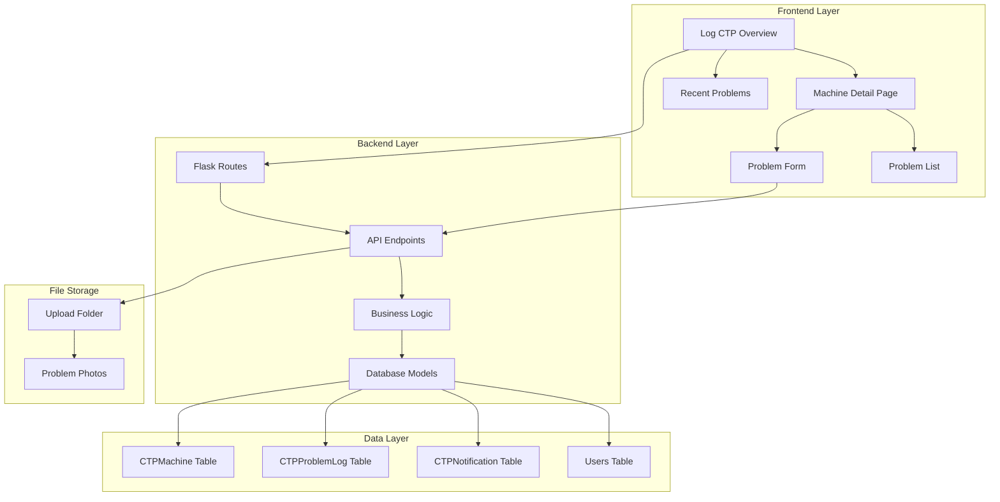
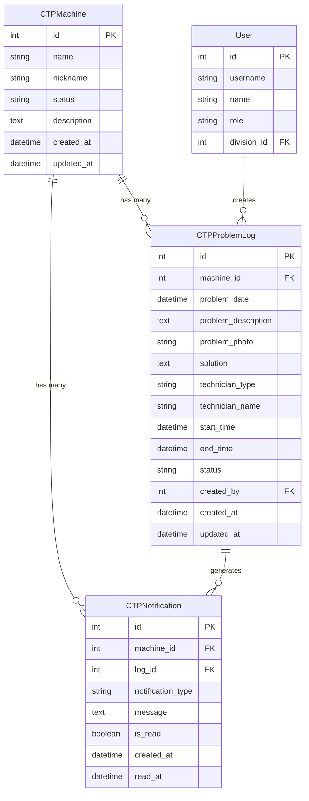
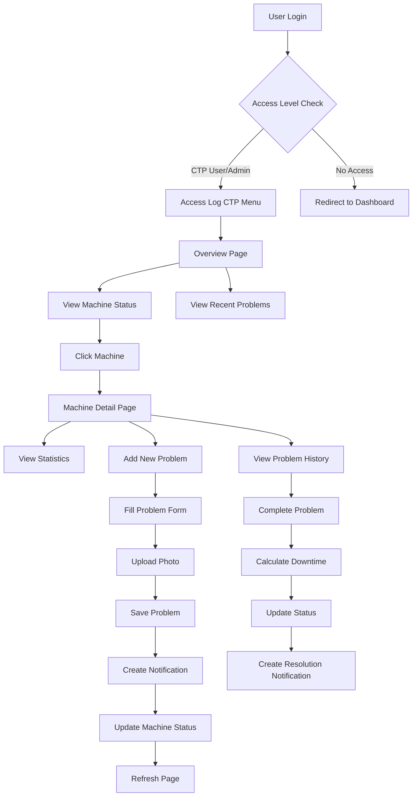
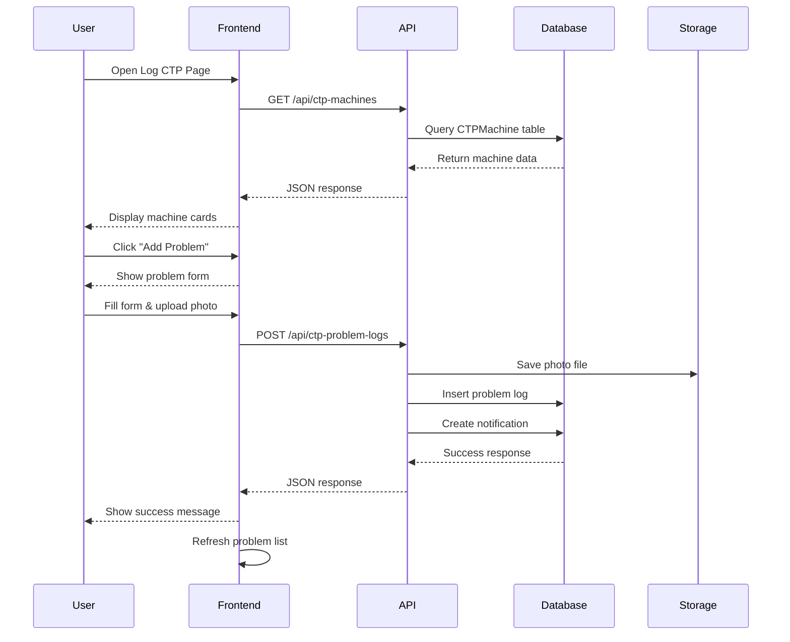
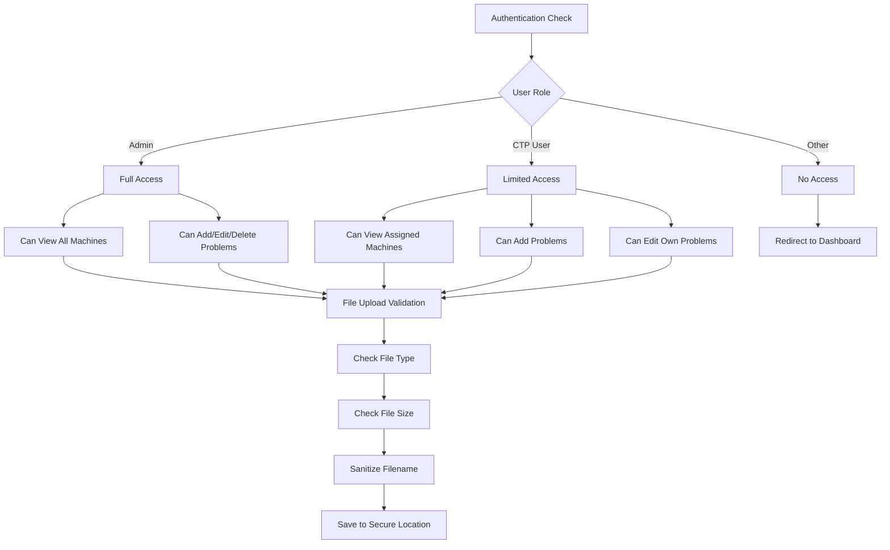
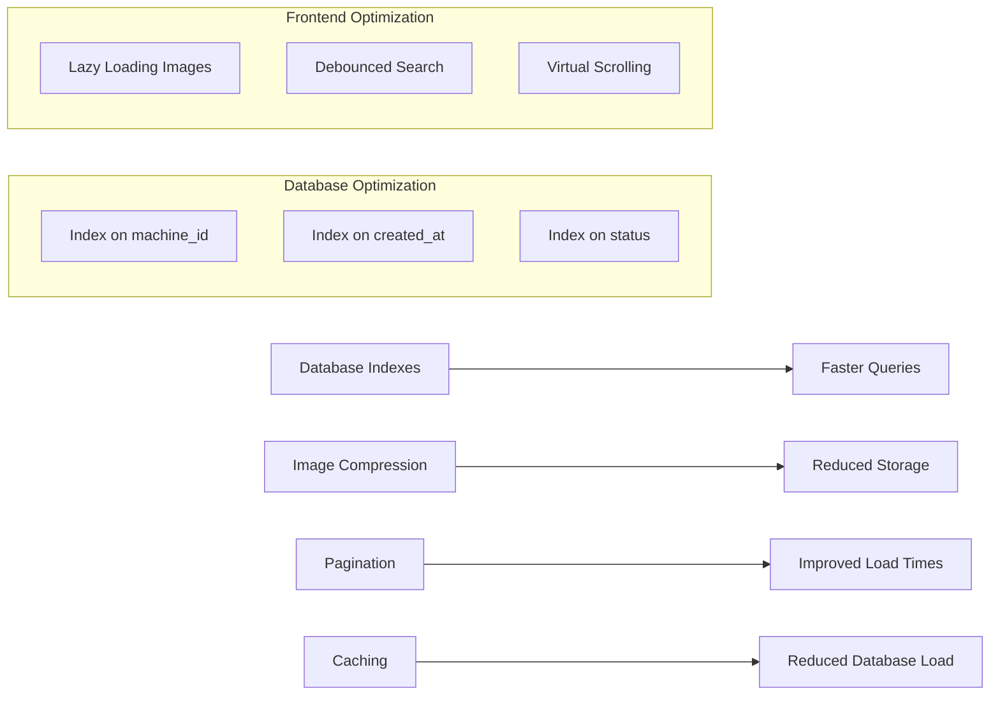
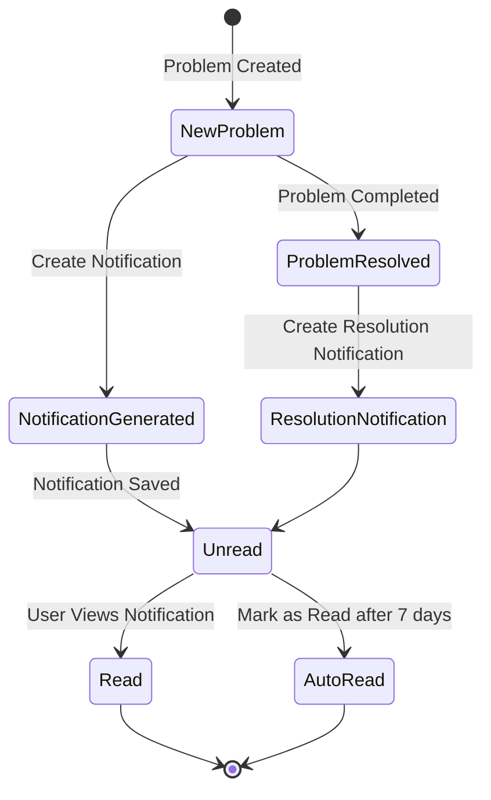
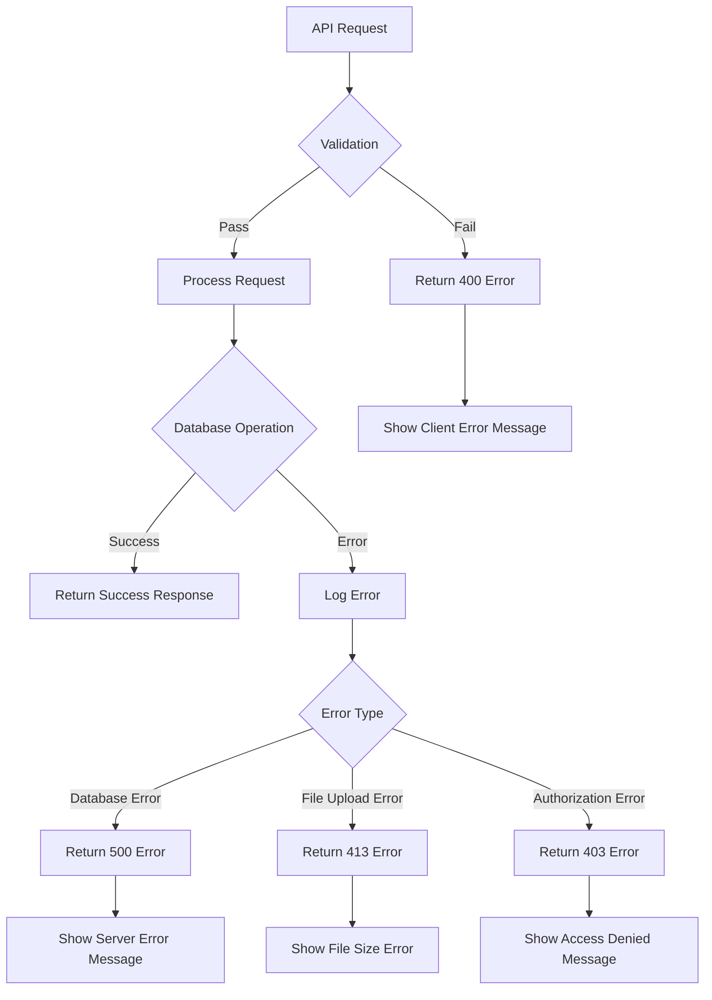

# CTP Log System Architecture

## System Overview



## Database Schema



## User Flow



## API Endpoints Structure

```mermaid
graph LR
    subgraph "GET Endpoints"
        A1[/api/ctp-machines]
        A2[/api/ctp-problem-logs]
        A3[/api/ctp-notifications]
    end
    
    subgraph "POST Endpoints"
        B1[/api/ctp-problem-logs]
    end
    
    subgraph "PUT Endpoints"
        C1[/api/ctp-problem-logs/:id]
        C2[/api/ctp-notifications/:id/read]
    end
    
    subgraph "DELETE Endpoints"
        D1[/api/ctp-problem-logs/:id]
    end
    
    A1 --> E[Get All Machines]
    A2 --> F[Get Problem Logs with Filters]
    A3 --> G[Get Unread Notifications]
    B1 --> H[Create New Problem Log]
    C1 --> I[Update Problem Log]
    C2 --> J[Mark Notification as Read]
    D1 --> K[Delete Problem Log]
```

## Component Interaction



## File Structure

```
impact/
├── templates/
│   ├── _sidebar.html (modified)
│   ├── log_ctp_overview.html (new)
│   └── log_ctp_detail.html (new)
├── static/
│   └── js/
│       ├── log_ctp_handler.js (new)
│       └── log_ctp_detail_handler.js (new)
├── uploads/
│   └── ctp_problems/ (new)
├── app.py (modified)
├── config.py (modified)
└── migrations/
    └── versions/
        └── create_ctp_log_tables.py (new)
```

## Security Considerations



## Performance Optimization



## Notification System Flow



## Error Handling Strategy



## Deployment Architecture

```mermaid
graph TB
    subgraph "Production Environment"
        A[Load Balancer] --> B[Web Server 1]
        A --> C[Web Server 2]
        
        B --> D[Application Server]
        C --> D
        
        D --> E[Database Cluster]
        D --> F[File Storage]
        
        G[Monitoring] --> D
        H[Backup System] --> E
        H --> F
    end
    
    subgraph "Development Environment"
        I[Local Server] --> J[Local Database]
        I --> K[Local Storage]
    end