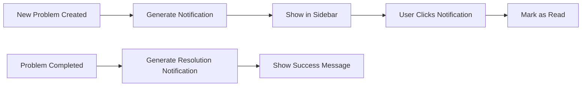

# CTP Log System - Implementation Summary

## Project Overview

Saya telah membuat rencana implementasi lengkap untuk fitur **Log CTP** yang akan memungkinkan user untuk memantau status mesin CTP (CTP 1, CTP 2, CTP 3) dan mencatat problem yang terjadi beserta solusi dan perhitungan downtime otomatis.

## 🎯 Fitur Utama yang Akan Diimplementasikan

### 1. **Status Monitoring Mesin CTP**
- Tampilan overview status ketiga mesin (Aktif/Perbaikan)
- Dashboard dengan statistik downtime
- Real-time status updates

### 2. **Problem Logging System**
- Input problem dengan foto dan keterangan
- Tracking teknisi (lokal/vendor)
- Perhitungan downtime otomatis
- Status tracking (ongoing/completed)

### 3. **Breadcrumb Navigation**
- CTP Production → Log CTP → CTP 1/2/3
- Navigasi yang intuitif sesuai permintaan

### 4. **Notifikasi System**
- Notifikasi di sidebar untuk problem baru
- Notifikasi saat problem selesai
- Counter notifikasi belum dibaca

## 📊 Database Design

### Tabel yang Akan Dibuat:
1. **ctp_machines** - Data mesin CTP
2. **ctp_problem_logs** - Log problem mesin
3. **ctp_notifications** - Sistem notifikasi

### Relationship:
- Setiap mesin memiliki banyak problem logs
- Setiap problem log dapat menghasilkan notifikasi
- User dapat membuat dan mengelola problem logs

## 🎨 Frontend Design

### Pages:
1. **Overview Page** (`/log-ctp`)
   - Status cards untuk 3 mesin
   - Recent problems table
   - Quick statistics

2. **Detail Page** (`/log-ctp/{machine}`)
   - Machine status dan statistics
   - Problem history dengan filter
   - Add problem form dengan photo upload
   - Downtime calculator otomatis

### UI Features:
- Responsive design untuk mobile
- Bootstrap 5 styling
- Font Awesome icons
- Interactive charts dan statistics
- Photo preview modal
- Real-time downtime calculation

## 🔧 Backend Implementation

### API Endpoints:
- `GET /api/ctp-machines` - Get all machines
- `GET /api/ctp-problem-logs` - Get problem logs dengan filter
- `POST /api/ctp-problem-logs` - Create new problem
- `PUT /api/ctp-problem-logs/:id` - Update problem
- `DELETE /api/ctp-problem-logs/:id` - Delete problem
- `GET /api/ctp-notifications` - Get notifications
- `PUT /api/ctp-notifications/:id/read` - Mark as read

### Security:
- Authentication check untuk setiap endpoint
- Role-based access control (CTP users & admin only)
- File upload validation
- SQL injection prevention

## 📁 File Structure

```
impact/
├── templates/
│   ├── _sidebar.html (modified - tambah menu Log CTP)
│   ├── log_ctp_overview.html (new)
│   └── log_ctp_detail.html (new)
├── static/
│   └── js/
│       ├── log_ctp_handler.js (new)
│       └── log_ctp_detail_handler.js (new)
├── uploads/
│   └── ctp_problems/ (new - untuk foto problem)
├── app.py (modified - tambah routes)
├── config.py (modified - upload config)
└── migrations/
    └── versions/
        └── create_ctp_log_tables.py (new)
```

## 🚀 Implementation Steps

### Phase 1: Database Setup
1. Create migration files
2. Run database migrations
3. Initialize machine data (CTP 1, 2, 3)
4. Test database relationships

### Phase 2: Backend Development
1. Add database models to app.py
2. Implement API endpoints
3. Add file upload handling
4. Implement authentication checks
5. Create notification system

### Phase 3: Frontend Development
1. Modify sidebar menu
2. Create overview page template
3. Create detail page template
4. Implement JavaScript handlers
5. Add responsive styling

### Phase 4: Integration & Testing
1. Test complete workflow
2. Test file upload functionality
3. Test notification system
4. Performance optimization
5. User acceptance testing

## 🔔 Notification Flow



## 📱 User Experience Flow

1. **User opens Log CTP menu**
2. **Sees overview of 3 machines**
3. **Clicks on specific machine (e.g., CTP 1 Suprasetter)**
4. **Views machine status and problem history**
5. **Clicks "Add Problem" for new issue**
6. **Fills form with problem details**
7. **Uploads photo of the problem**
8. **Sets technician info**
9. **System calculates downtime automatically**
10. **Saves problem and creates notification**
11. **When problem is resolved, user marks as complete**
12. **System updates status and calculates total downtime**

## 🎯 Key Benefits

### For Management:
- **Visibility**: Clear overview of all machine statuses
- **Analytics**: Downtime tracking and trend analysis
- **History**: Complete log of all problems and solutions
- **Decision Making**: Data-driven maintenance decisions

### For CTP Operators:
- **Easy Reporting**: Simple form for problem reporting
- **Photo Documentation**: Visual evidence of problems
- **Status Tracking**: Real-time status of machines
- **Technician Coordination**: Clear assignment and tracking

### For Technicians:
- **Clear Information**: Detailed problem descriptions with photos
- **History**: Previous solutions for similar problems
- **Time Tracking**: Accurate downtime calculation
- **Documentation**: Complete maintenance records

## 🔧 Technical Specifications

### Database Requirements:
- MySQL/SQLite compatible
- Foreign key constraints
- Indexes for performance
- Migration support via Alembic

### File Upload:
- Supported formats: PNG, JPG, JPEG, GIF
- Max file size: 16MB
- Secure filename handling
- Organized storage structure

### Performance:
- Pagination for large datasets
- Database indexing
- Lazy loading for images
- Caching for frequently accessed data

## 🛡️ Security Measures

1. **Authentication**: Role-based access control
2. **File Upload**: Type and size validation
3. **Input Validation**: XSS prevention
4. **SQL Injection**: Parameterized queries
5. **CSRF Protection**: Form tokens

## 📋 Testing Checklist

### Functional Testing:
- [ ] User can access Log CTP menu
- [ ] Overview page displays correctly
- [ ] Machine detail pages work
- [ ] Problem form validation works
- [ ] Photo upload functions
- [ ] Downtime calculation accurate
- [ ] Notifications appear correctly
- [ ] Filters and search work

### Security Testing:
- [ ] Unauthorized access blocked
- [ ] File upload validation works
- [ ] Input sanitization effective
- [ ] SQL injection protection active

### Performance Testing:
- [ ] Page load times acceptable
- [ ] Large datasets handled well
- [ ] File uploads efficient
- [ ] Database queries optimized

## 🚀 Deployment Preparation

### Pre-deployment:
1. Backup existing database
2. Run migration scripts
3. Test in staging environment
4. Performance testing
5. Security audit

### Post-deployment:
1. Monitor system performance
2. Check error logs
3. User training sessions
4. Collect feedback
5. Plan improvements

## 📈 Future Enhancements

### Short Term:
- Mobile app for technicians
- Email notifications for critical problems
- Export reports to PDF/Excel
- Problem categorization system

### Long Term:
- Integration with maintenance scheduling
- Predictive maintenance using AI
- Integration with spare parts inventory
- Advanced analytics dashboard

## 📞 Support & Maintenance

### Monitoring:
- Application performance monitoring
- Database performance tracking
- Error log monitoring
- User activity analytics

### Backup Strategy:
- Daily database backups
- File storage backups
- Configuration backups
- Disaster recovery plan

---

## 🎉 Conclusion

Rencana implementasi Log CTP ini telah dirancang secara komprehensif untuk memenuhi semua kebutuhan yang Anda sampaikan:

✅ **Status monitoring untuk 3 mesin CTP**  
✅ **Problem logging dengan foto dan keterangan**  
✅ **Perhitungan downtime otomatis**  
✅ **Breadcrumb navigation sesuai permintaan**  
✅ **Notifikasi system di sidebar**  
✅ **Access control untuk CTP users dan admin**  

Dengan arsitektur yang solid dan rencana implementasi yang detail, sistem ini akan memberikan nilai tambah yang signifikan untuk manajemen mesin CTP di perusahaan Anda.

**Next Step**: Saya merekomendasikan untuk beralih ke **Code Mode** untuk implementasi aktual dari rencana ini.