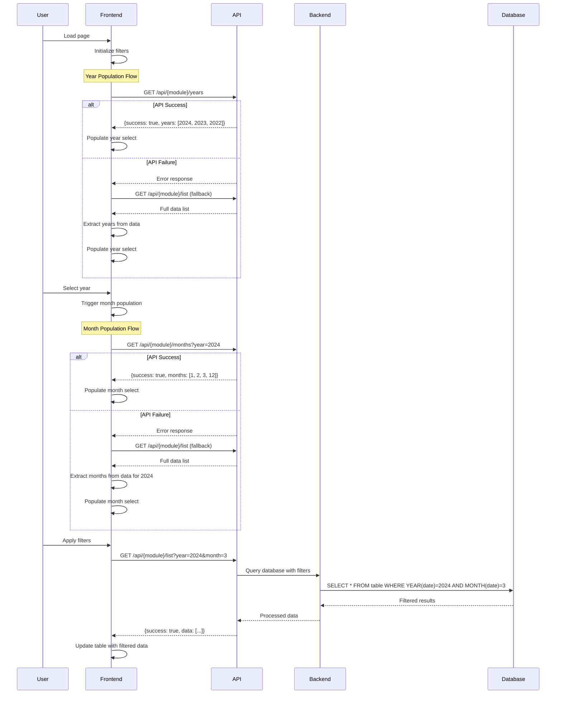
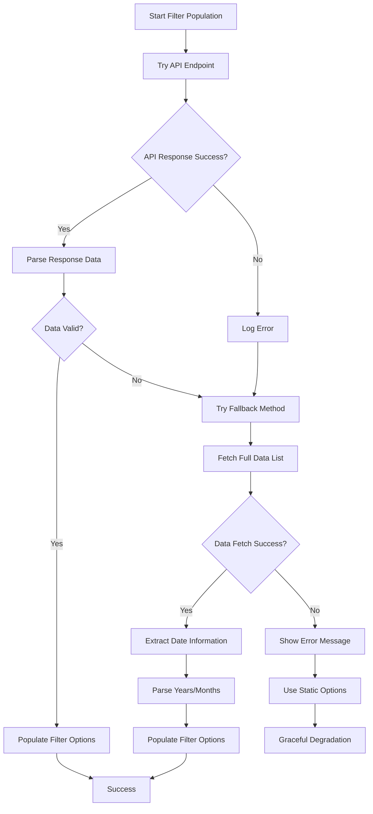
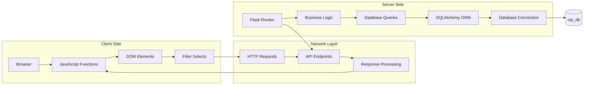

# Dynamic Filter Architecture

## System Architecture Diagram

```mermaid
graph TB
    subgraph "Frontend Layer"
        A[tabelkpictp.html] --> B[Dynamic Filter JS]
        C[dashboard_ctp.html] --> B
        D[stock_opname_ctp.html] --> B
        E[chemical_bon_ctp.html] --> B
        
        B --> F[populateYearOptions]
        B --> G[populateMonthOptions]
        B --> H[extractYearsFromExistingData]
        B --> I[extractMonthsFromExistingData]
    end
    
    subgraph "API Layer"
        J[/api/ctp-production-logs/years]
        K[/api/ctp-production-logs/months]
        L[/api/chemical-bon-ctp/years]
        M[/api/chemical-bon-ctp/months]
        
        N[/get-kpi-data]
        O[/get-stock-opname-data]
        P[/api/chemical-bon-ctp/list]
    end
    
    subgraph "Backend Layer"
        Q[CtpProductionLog Model]
        R[ChemicalBonCTP Model]
        S[Database - ctp_db]
        
        Q --> S
        R --> S
    end
    
    F --> J
    F --> L
    G --> K
    G --> M
    H --> N
    H --> O
    H --> P
    I --> N
    I --> O
    I --> P
    
    J --> Q
    K --> Q
    L --> R
    M --> R
    N --> Q
    O --> Q
    P --> R
```

## Implementation Flow Diagram



## Error Handling Flow



## Data Flow Architecture



## Component Interaction Matrix

| Component | Responsibility | Data Source | Output |
|-----------|----------------|--------------|---------|
| `populateYearOptions()` | Fetch available years | API or fallback data | Year select options |
| `populateMonthOptions()` | Fetch available months for year | API or fallback data | Month select options |
| `extractYearsFromExistingData()` | Fallback year extraction | Full data list | Year array |
| `extractMonthsFromExistingData()` | Fallback month extraction | Full data list | Month array |
| `/api/ctp-production-logs/years` | Backend year service | ctp_production_logs.log_date | JSON years list |
| `/api/ctp-production-logs/months` | Backend month service | ctp_production_logs.log_date | JSON months list |
| `/api/chemical-bon-ctp/years` | Backend year service | chemical_bon_ctp.tanggal | JSON years list |
| `/api/chemical-bon-ctp/months` | Backend month service | chemical_bon_ctp.tanggal | JSON months list |

## Technology Stack

### Frontend
- **HTML5**: Template structure
- **Bootstrap 5**: UI components
- **JavaScript ES6+**: Dynamic functionality
- **Fetch API**: HTTP requests

### Backend
- **Flask**: Web framework
- **SQLAlchemy**: ORM
- **SQLite/MySQL**: Database
- **Python 3.8+**: Runtime

### Database Schema
```sql
-- ctp_production_logs table
CREATE TABLE ctp_production_logs (
    id INTEGER PRIMARY KEY,
    log_date DATE NOT NULL,
    -- other fields...
);

-- chemical_bon_ctp table  
CREATE TABLE chemical_bon_ctp (
    id INTEGER PRIMARY KEY,
    tanggal DATE NOT NULL,
    -- other fields...
);
```

## Performance Considerations

### Database Optimization
- Add indexes on date columns: `CREATE INDEX idx_log_date ON ctp_production_logs(log_date)`
- Use efficient date extraction queries
- Implement query result caching

### Frontend Optimization
- Debounce filter change events
- Implement loading indicators
- Cache API responses locally
- Use async/await for non-blocking operations

### Network Optimization
- Minimize API calls through intelligent caching
- Use appropriate HTTP status codes
- Implement request timeouts
- Compress API responses

## Security Considerations

### API Security
- Require authentication for all endpoints
- Validate input parameters
- Implement rate limiting
- Use HTTPS in production

### Data Validation
- Sanitize user inputs
- Validate date formats
- Handle SQL injection prevention
- Implement proper error messages

## Monitoring & Logging

### Frontend Monitoring
- Console error logging
- User interaction tracking
- Performance metrics
- Error reporting

### Backend Monitoring
- API request logging
- Database query performance
- Error tracking
- Resource usage monitoring