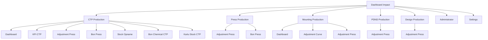
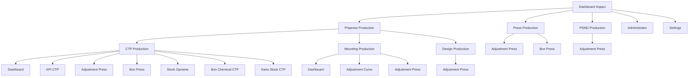

# Menu Structure Visualization

## Current Menu Structure

## New Menu Structure

## Access Control Logic
- **Prepress Production**: Visible if `can_access_ctp()` OR `can_access_mounting()` OR `can_access_design()`
- **CTP Production**: Visible if `can_access_ctp()`
- **Mounting Production**: Visible if `can_access_mounting()`
- **Design Production**: Visible if `can_access_design()`
- **Press Production**: Visible if `can_access_press()` OR `can_access_ctp()` OR `can_access_mounting()` OR `can_access_pdnd()` OR `can_access_design()`
- **PDND Production**: Visible if `can_access_pdnd()`