# Arsitektur Sistem Work Order Incoming

## 1. Diagram Arsitektur Sistem

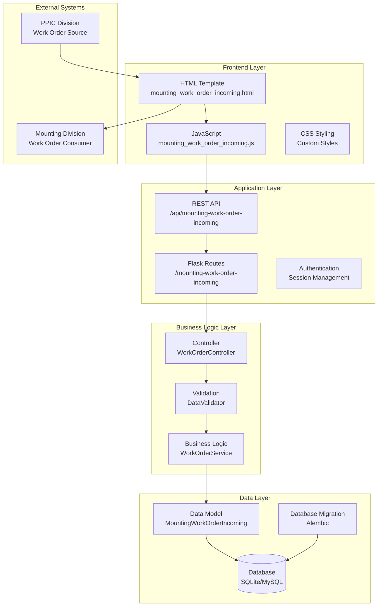

## 2. Data Flow Diagram

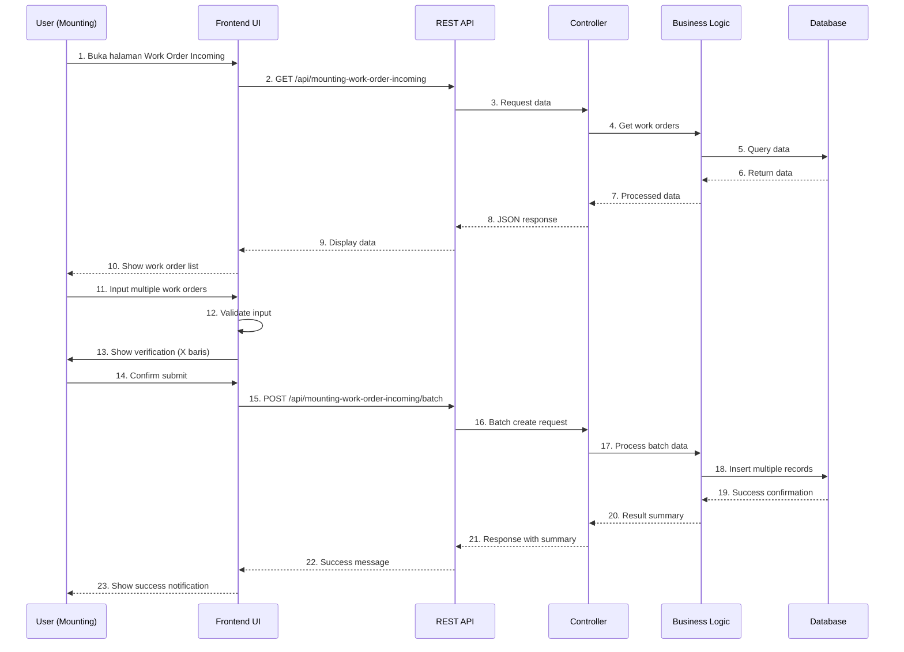

## 3. Component Architecture

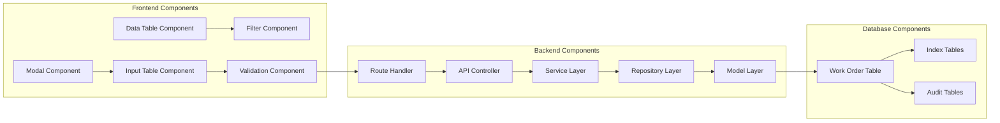

## 4. State Management

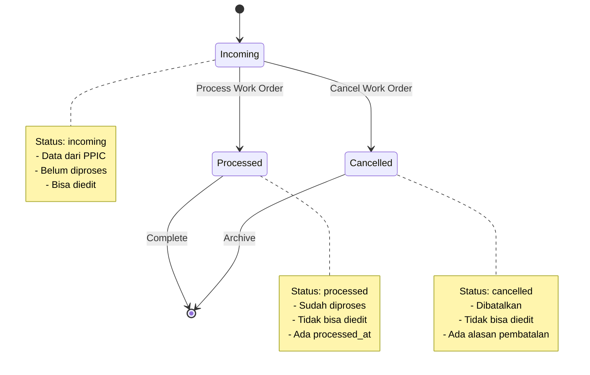

## 5. Database Schema

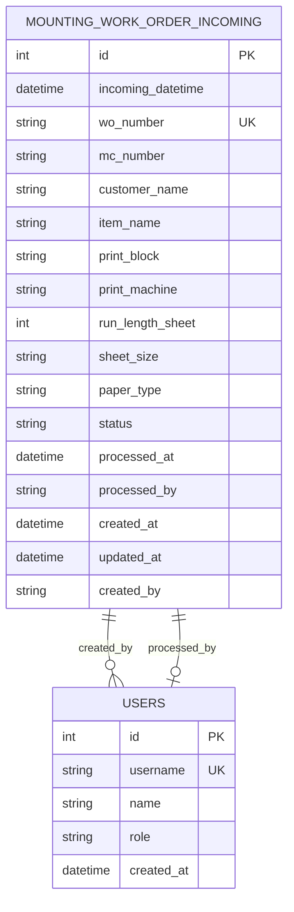

## 6. API Request Flow

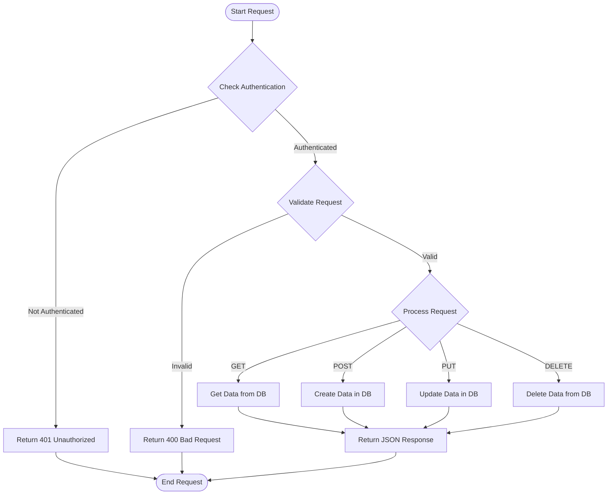

## 7. Frontend Component Structure

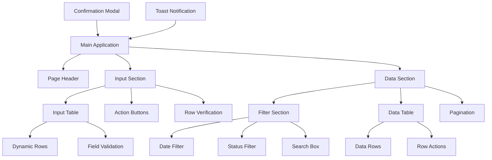

## 8. Security Architecture

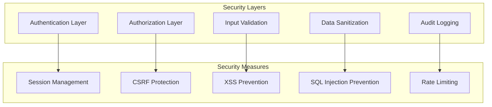

## 9. Performance Optimization

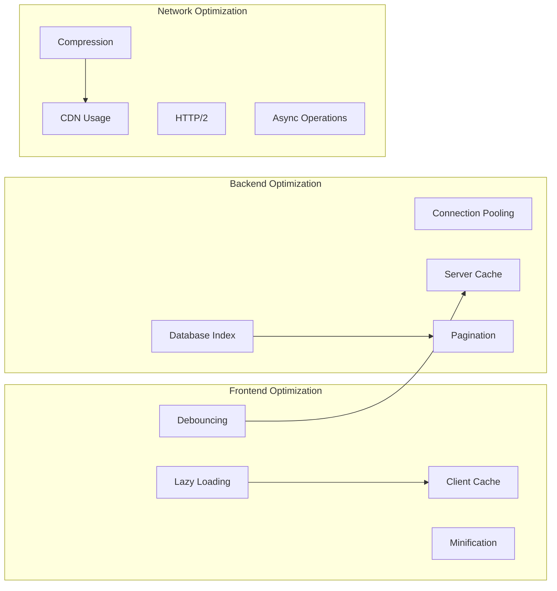

## 10. Deployment Architecture

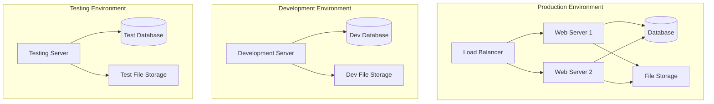

## 11. Monitoring and Logging

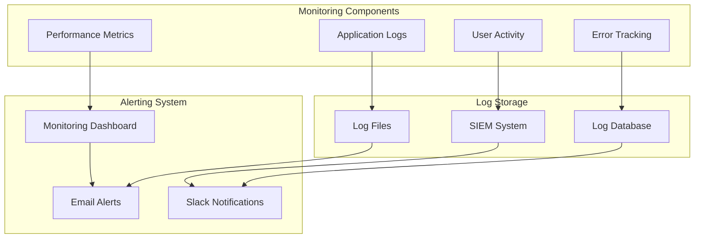

## 12. Integration Points

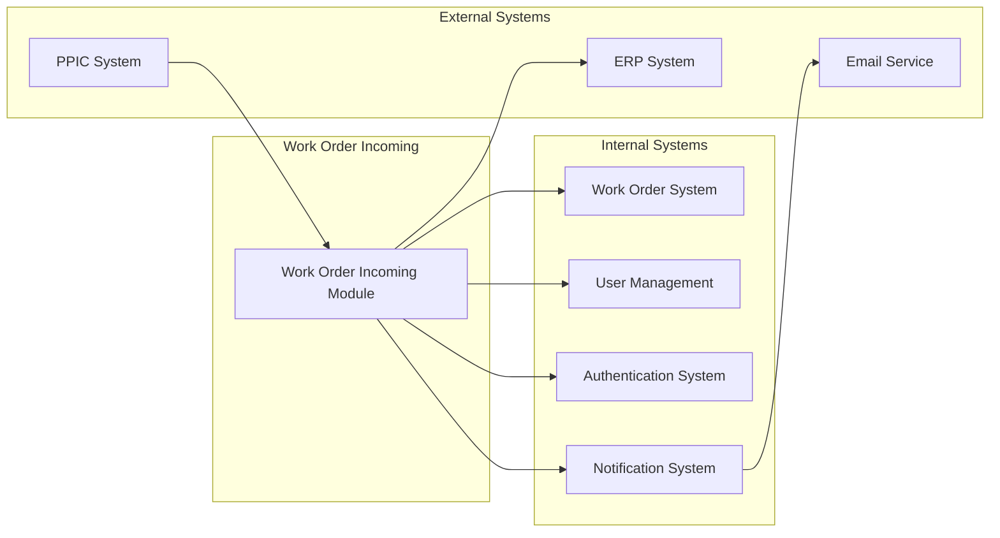

## 13. Technology Stack

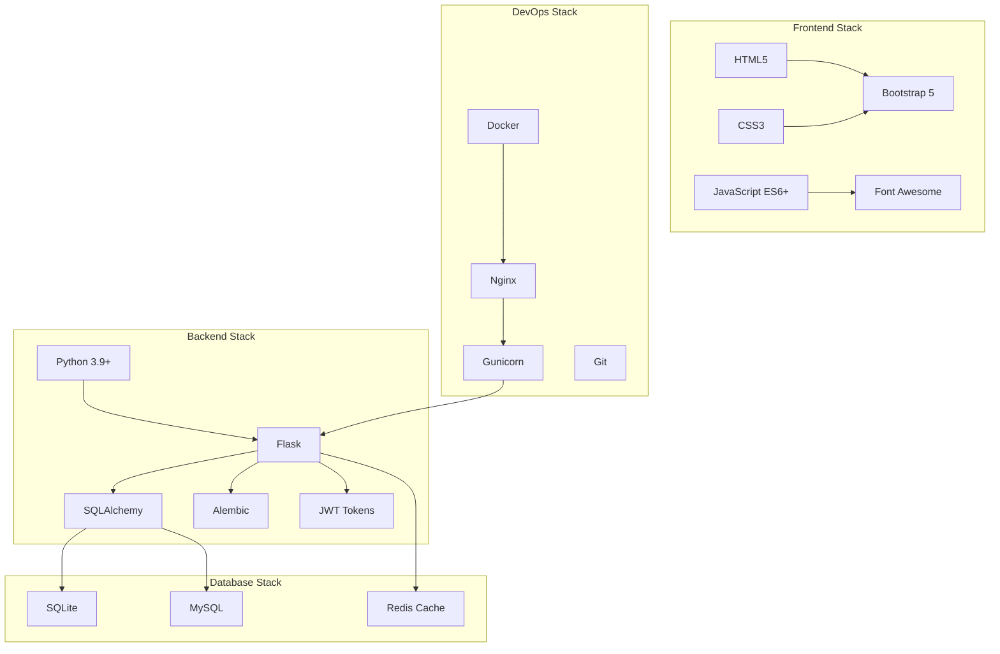

## 14. Development Workflow

```mermaid
gitgraph
    commit id: "Initial Setup"
    branch feature-model
    checkout feature-model
    commit id: "Create Database Model"
    checkout main
    merge feature-model
    
    branch feature-api
    checkout feature-api
    commit id: "Implement API Endpoints"
    checkout main
    merge feature-api
    
    branch feature-ui
    checkout feature-ui
    commit id: "Create HTML Template"
    commit id: "Implement JavaScript"
    checkout main
    merge feature-ui
    
    branch feature-integration
    checkout feature-integration
    commit id: "Integrate Components"
    commit id: "Add Navigation Menu"
    checkout main
    merge feature-integration
    
    branch testing
    checkout testing
    commit id: "Unit Tests"
    commit id: "Integration Tests"
    commit id: "Bug Fixes"
    checkout main
    merge testing
    
    commit id: "Production Release"
```

## 15. Risk Assessment

```mermaid
mindmap
  root((Risks))
    Technical Risks
      Database Performance
      API Scalability
      Frontend Compatibility
      Security Vulnerabilities
    Business Risks
      User Adoption
      Data Quality
      Process Integration
      Training Requirements
    Operational Risks
      System Downtime
      Data Loss
      Backup Failure
      Recovery Time
    Mitigation Strategies
      Performance Testing
      Security Audits
      User Training
      Backup Planning
      Monitoring Systems