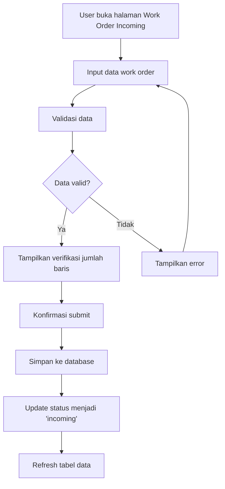

# Rencana Pengembangan Work Order Incoming untuk Mounting Production

## 1. Analisis Kebutuhan dan Desain Database

### 1.1. Model Database (models_mounting.py)

Berdasarkan kebutuhan user, berikut adalah desain database untuk Work Order Incoming:

```python
from flask_sqlalchemy import SQLAlchemy
from datetime import datetime
import pytz

# SQLAlchemy instance akan disediakan oleh app.py
db = SQLAlchemy()

jakarta_tz = pytz.timezone('Asia/Jakarta')

class MountingWorkOrderIncoming(db.Model):
    """
    Model untuk Work Order Incoming pada Mounting Production
    Data ini berasal dari divisi PPIC dan akan diproses oleh divisi Mounting
    """
    __tablename__ = 'mounting_work_order_incoming'
    
    id = db.Column(db.Integer, primary_key=True)
    incoming_datetime = db.Column(db.DateTime, nullable=False, default=lambda: datetime.now(jakarta_tz))
    wo_number = db.Column(db.String(100), nullable=False)
    mc_number = db.Column(db.String(100), nullable=False)
    customer_name = db.Column(db.String(255), nullable=False)
    item_name = db.Column(db.String(255), nullable=False)
    print_block = db.Column(db.String(100), nullable=False)  # Nomor MC, Mesin & Kertas
    print_machine = db.Column(db.String(100), nullable=False)  # Mesin Cetak
    run_length_sheet = db.Column(db.Integer, nullable=True)
    sheet_size = db.Column(db.String(100), nullable=True)
    paper_type = db.Column(db.String(100), nullable=True)
    
    # Status tracking
    status = db.Column(db.String(50), nullable=False, default='incoming')  # incoming, processed, cancelled
    processed_at = db.Column(db.DateTime, nullable=True)
    processed_by = db.Column(db.String(100), nullable=True)
    
    # Metadata
    created_at = db.Column(db.DateTime, default=lambda: datetime.now(jakarta_tz))
    updated_at = db.Column(db.DateTime, default=lambda: datetime.now(jakarta_tz), onupdate=lambda: datetime.now(jakarta_tz))
    created_by = db.Column(db.String(100), nullable=True)
    
    def to_dict(self):
        """Convert model instance to dictionary"""
        return {
            'id': self.id,
            'incoming_datetime': self.incoming_datetime.isoformat() if self.incoming_datetime else None,
            'wo_number': self.wo_number,
            'mc_number': self.mc_number,
            'customer_name': self.customer_name,
            'item_name': self.item_name,
            'print_block': self.print_block,
            'print_machine': self.print_machine,
            'run_length_sheet': self.run_length_sheet,
            'sheet_size': self.sheet_size,
            'paper_type': self.paper_type,
            'status': self.status,
            'processed_at': self.processed_at.isoformat() if self.processed_at else None,
            'processed_by': self.processed_by,
            'created_at': self.created_at.isoformat() if self.created_at else None,
            'updated_at': self.updated_at.isoformat() if self.updated_at else None,
            'created_by': self.created_by
        }
    
    def __repr__(self):
        return f'<MountingWorkOrderIncoming {self.wo_number} - {self.customer_name}>'
```

### 1.2. Struktur Tabel

| Field | Type | Nullable | Default | Description |
|-------|------|----------|---------|-------------|
| id | Integer (PK) | No | Auto increment |
| incoming_datetime | DateTime | No | Current timestamp |
| wo_number | String(100) | No | Nomor Work Order |
| mc_number | String(100) | No | Nomor MC |
| customer_name | String(255) | No | Nama Customer |
| item_name | String(255) | No | Nama Item |
| print_block | String(100) | No | Nomor MC, Mesin & Kertas |
| print_machine | String(100) | No | Mesin Cetak |
| run_length_sheet | Integer | Yes | Run Length Sheet |
| sheet_size | String(100) | Yes | Ukuran Kertas |
| paper_type | String(100) | Yes | Jenis Kertas |
| status | String(50) | No | 'incoming' |
| processed_at | DateTime | Yes | Null |
| processed_by | String(100) | Yes | Null |
| created_at | DateTime | No | Current timestamp |
| updated_at | DateTime | No | Current timestamp, auto-update |
| created_by | String(100) | Yes | Null |

## 2. Desain UI/UX

### 2.1. Template HTML (mounting_work_order_incoming.html)

Berdasarkan template mounting yang sudah ada, desain UI akan mengikuti pattern yang sama:

1. **Header Section**: Gradient biru mounting dengan judul "Work Order Incoming"
2. **Input Section**: Form input seperti Excel dengan kemampuan:
   - Input multiple baris sekaligus
   - Tambah/hapus baris dinamis
   - Validasi data sebelum submit
   - Verifikasi jumlah baris
3. **Data Table**: Menampilkan data yang sudah masuk
4. **Filter Section**: Filter berdasarkan tanggal, status, customer

### 2.2. Fitur Input Multiple (Excel-like)

```javascript
// Struktur data untuk input multiple
const workOrderData = [
    {
        "wo_number": "WO001",
        "mc_number": "MC001", 
        "customer_name": "Customer A",
        "item_name": "Item A",
        "print_block": "Block A",
        "print_machine": "Machine A",
        "run_length_sheet": 1000,
        "sheet_size": "A4",
        "paper_type": "HVS"
    },
    // ... more rows
];
```

### 2.3. Validasi dan Verifikasi

1. **Validasi per baris**:
   - WO Number tidak boleh kosong
   - MC Number tidak boleh kosong
   - Customer Name tidak boleh kosong
   - Item Name tidak boleh kosong
   - Print Block tidak boleh kosong
   - Print Machine tidak boleh kosong

2. **Verifikasi sebelum submit**:
   - Menampilkan pesan: "Terdapat X work order yang akan disubmit. Lanjutkan?"
   - Konfirmasi sebelum menyimpan

## 3. API Endpoints

### 3.1. GET Endpoints

1. `/impact/mounting-work-order-incoming` - Menampilkan halaman
2. `/impact/api/mounting-work-order-incoming` - Get all data dengan pagination
3. `/impact/api/mounting-work-order-incoming/<int:id>` - Get detail by ID

### 3.2. POST Endpoints

1. `/impact/api/mounting-work-order-incoming/batch` - Submit multiple work orders
2. `/impact/api/mounting-work-order-incoming` - Submit single work order

### 3.3. PUT/PATCH Endpoints

1. `/impact/api/mounting-work-order-incoming/<int:id>` - Update work order

### 3.4. DELETE Endpoints

1. `/impact/api/mounting-work-order-incoming/<int:id>` - Delete work order

## 4. Integrasi dengan Sidebar

Menu akan ditambahkan ke dalam submenu Mounting:

```html
<a href="/impact/mounting-work-order-incoming" class="list-group-item list-group-item-action ps-5" id="mountingWorkOrderIncomingLink">
    <svg width="18" height="18" viewBox="0 0 24 24" fill="none" stroke="currentColor" stroke-width="1.6" stroke-linecap="round" stroke-linejoin="round" aria-hidden="true">
        <path d="M14 2H6a2 2 0 0 0-2 2v16a2 2 0 0 0 2 2h12a2 2 0 0 0 2-2V8z"/>
        <polyline points="14 2 14 8 20 8"/>
        <line x1="16" y1="13" x2="8" y2="13"/>
        <line x1="16" y1="17" x2="8" y2="17"/>
    </svg>
    <span>Work Order Incoming</span>
</a>
```

## 5. Flow Kerja



## 6. File yang Dibutuhkan

1. **models_mounting.py** - Model database
2. **templates/mounting_work_order_incoming.html** - Template HTML
3. **static/js/mounting_work_order_incoming.js** - JavaScript frontend
4. **routes/mounting_work_order_incoming.py** - Route handlers (opsional, bisa di app.py)

## 7. Prioritas Pengembangan

1. Model database (models_mounting.py)
2. Template HTML dengan UI konsisten
3. JavaScript untuk input multiple dan validasi
4. API endpoints untuk CRUD operations
5. Integrasi dengan sidebar
6. Testing dan debugging

## 8. Catatan Tambahan

1. Menggunakan timezone Asia/Jakarta untuk semua datetime
2. Mengikuti pattern UI yang sudah ada di mounting
3. Menggunakan Bootstrap 5 dan Font Awesome untuk icons
4. Responsive design untuk mobile dan desktop
5. Error handling yang user-friendly
6. Loading indicators untuk async operations