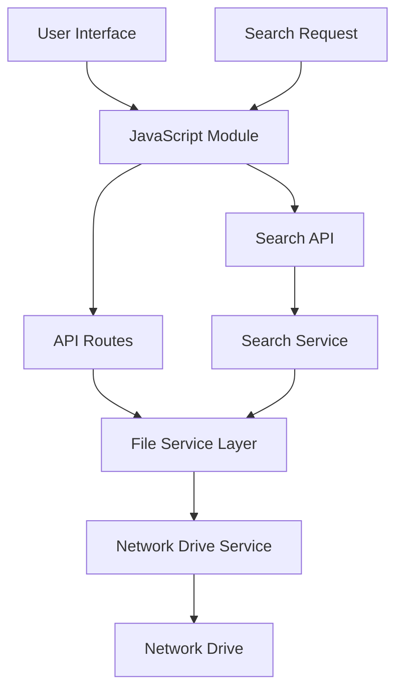

# RND WebCenter Architecture

## Overview

RND WebCenter adalah modul baru dalam aplikasi Impact yang menyediakan antarmuka file explorer modern untuk mengakses konten dari network drive `\\172.27.168.10\PT. Epson\00.DATA BASE EPSON`. Modul ini dirancang sebagai solusi terpisah dari RND CloudSphere untuk menjaga integritas kode dan fungsionalitas.

## Requirements

Berdasarkan analisis kebutuhan pengguna:

1. **Read-only access**: File explorer hanya untuk melihat file tanpa kemampuan modifikasi
2. **File type icons**: Ikon khusus untuk berbagai jenis file (PDF, gambar, Excel, dll)
3. **Search functionality**: Kemampuan pencarian file dalam network drive
4. **Access control**: Saat ini semua user memiliki akses yang sama (belum ada diferensiasi)
5. **Modern UI**: Tampilan yang clean, minimalis, dan modern
6. **Network drive connectivity**: Akses ke `\\172.27.168.10\PT. Epson\00.DATA BASE EPSON`

## Architecture Design

### 1. Module Structure

```
rnd_webcenter/
├── __init__.py
├── routes.py              # Flask routes untuk file explorer
├── services.py            # Business logic untuk file operations
├── utils.py              # Helper functions
└── static/
    ├── css/
    │   └── rnd_webcenter.css
    └── js/
        └── rnd_webcenter.js
```

### 2. Blueprint Integration

Modul akan diimplementasikan sebagai Flask Blueprint terpisah:
- **Blueprint name**: `rnd_webcenter_bp`
- **URL prefix**: `/rnd-webcenter`
- **Template folder**: `templates/rnd_webcenter/`

### 3. Component Architecture

#### Backend Components

1. **File Service Layer** (`services.py`)
   - `NetworkDriveService`: Kelas untuk mengakses network drive
   - `FileExplorerService`: Kelas untuk operasi file explorer
   - `SearchService`: Kelas untuk fungsionalitas pencarian

2. **Route Handlers** (`routes.py`)
   - Route untuk halaman utama file explorer
   - API endpoints untuk operasi file
   - Error handling untuk network drive access

3. **Utility Functions** (`utils.py`)
   - File type detection
   - Icon mapping
   - Path normalization

#### Frontend Components

1. **Main Template** (`templates/rnd_webcenter/file_explorer.html`)
   - File browser interface
   - Search bar
   - Breadcrumb navigation
   - File grid/list view toggle

2. **JavaScript Module** (`static/js/rnd_webcenter.js`)
   - File navigation logic
   - Search functionality
   - AJAX calls to backend
   - Responsive UI interactions

3. **CSS Stylesheet** (`static/css/rnd_webcenter.css`)
   - Modern, clean design
   - File type icons
   - Responsive layout
   - Animation and transitions

### 4. Data Flow



### 5. Network Drive Access Strategy

#### Challenge
- Network drive path: `\\172.27.168.10\PT. Epson\00.DATA BASE EPSON`
- Python `os` module limitations with UNC paths
- Cross-platform compatibility considerations

#### Solution
1. **Windows UNC Path Handling**
   - Use `os.path` with proper normalization
   - Implement fallback mechanisms
   - Error handling for network connectivity issues

2. **Caching Strategy**
   - Directory structure caching for performance
   - Lazy loading of file contents
   - Cache invalidation on access errors

3. **Security Considerations**
   - Path traversal prevention
   - Access validation
   - Error message sanitization

### 6. File Type Detection & Icons

#### Supported File Types
- **Documents**: PDF, DOC, DOCX, XLS, XLSX, PPT, PPTX
- **Images**: JPG, JPEG, PNG, GIF, BMP, SVG
- **Archives**: ZIP, RAR, 7Z, TAR, GZ
- **Other**: Default icon for unrecognized types

#### Icon Implementation
- Font-based icons (Font Awesome or similar)
- CSS classes for different file types
- Fallback to default icon

### 7. Search Functionality

#### Search Features
- **File name search**: Case-insensitive partial matching
- **File extension filter**: Filter by file type
- **Path-based search**: Search within specific directories
- **Recent files**: Quick access to recently accessed files

#### Search Implementation
- Backend search with directory traversal
- Frontend filtering for instant results
- Search history for quick access

### 8. UI/UX Design

#### Design Principles
- **Clean interface**: Minimal clutter, focus on content
- **Intuitive navigation**: Breadcrumbs, back/forward functionality
- **Responsive design**: Works on desktop and tablet
- **Performance**: Lazy loading, virtual scrolling for large directories

#### Layout Structure
```
┌─────────────────────────────────────────────────────────┐
│ Header: Search Bar | View Toggle | Settings    │
├─────────────────────────────────────────────────────────┤
│ Breadcrumb Navigation: Home > Folder > Subfolder    │
├─────────────────────────────────────────────────────────┤
│                                                 │
│  [📁] Folder1    [📄] File1.pdf          │
│  [📁] Folder2    [📊] File2.xlsx          │
│  [📁] Folder3    [🖼️] File3.jpg           │
│                                                 │
├─────────────────────────────────────────────────────────┤
│ Status Bar: X items | Total size: Y MB        │
└─────────────────────────────────────────────────────────┘
```

### 9. Integration Points

#### Menu Integration
- Add new menu item in RND Production section
- Update `_sidebar.html` with new route
- Maintain existing navigation patterns

#### Application Integration
- Register blueprint in `app.py`
- Follow existing authentication patterns
- Use existing database session management

### 10. Error Handling

#### Network Drive Errors
- Connection timeout handling
- Permission denied scenarios
- Network path unavailable

#### User Experience
- Graceful error messages
- Retry mechanisms
- Fallback content display

### 11. Performance Considerations

#### Optimization Strategies
- Directory listing pagination
- Lazy loading of file contents
- Client-side caching
- Minimal server round trips

#### Scalability
- Handle large directory structures
- Efficient search algorithms
- Memory-conscious file operations

## Implementation Plan

### Phase 1: Core Infrastructure
1. Create blueprint structure
2. Implement network drive service
3. Basic file listing functionality
4. Error handling framework

### Phase 2: User Interface
1. HTML template development
2. CSS styling implementation
3. JavaScript functionality
4. Responsive design

### Phase 3: Advanced Features
1. Search functionality
2. File type icons
3. Performance optimizations
4. User experience enhancements

### Phase 4: Integration & Testing
1. Menu integration
2. Application registration
3. Testing and validation
4. Documentation

## Technical Specifications

### Dependencies
- Flask Blueprint (existing)
- Python os and pathlib modules
- Font Awesome for icons
- Bootstrap 5 (existing framework)

### Browser Compatibility
- Modern browsers (Chrome, Firefox, Edge, Safari)
- JavaScript ES6+ support required
- Responsive design for mobile devices

### Security Considerations
- Path traversal prevention
- Input sanitization
- Error information disclosure prevention
- Access logging

## Conclusion

RND WebCenter akan menyediakan solusi file explorer yang modern dan efisien untuk mengakses network drive Epson. Dengan arsitektur yang modular dan terpisah, modul ini dapat dikembangkan dan dikelola secara independen sambil tetap terintegrasi dengan baik ke dalam aplikasi Impact yang ada.